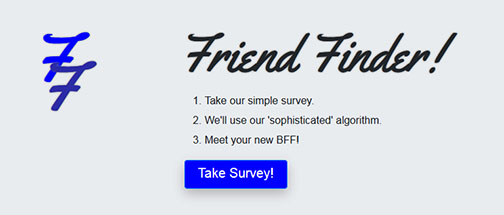

# Friend Finder
Friend Finder is a simulation find-a-friend app, that is used for entertainment purposes only. It implements a 10 question survey and depending on the user's input will use a 'sophisticated algorithm' and output your new best friend.

__NOTE: You can either run it locally on your machine with the installation instructions below, or visit the live application link provided.__

## Installation
1) git clone this repository
2) cd friend-finder
3) npm install
4) node server.js
5) go to your favorite web-browser and load localhost:3000/
6) Enjoy the app!

## Live Application

## Built with
* Javascript & jQuery
* Bootstrap
* Google Fonts
* Node.js
* Express.js
* Heroku

# Collaborator
 
   Sharon Patten

# Screenshot

